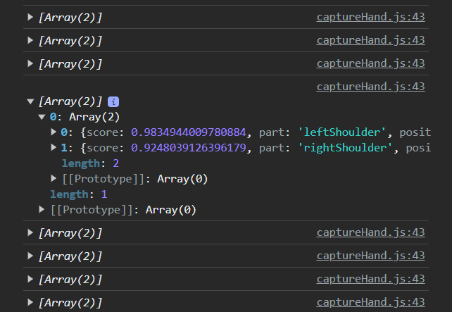
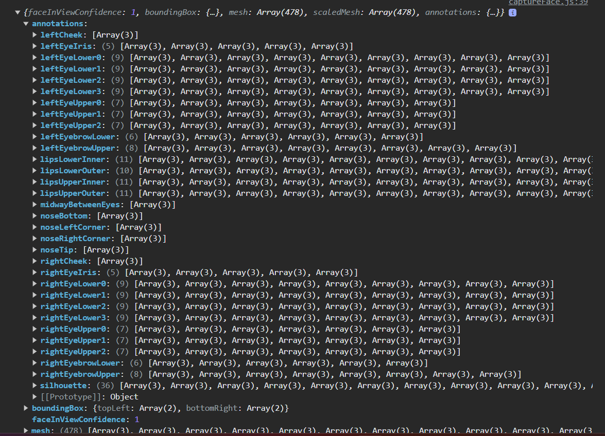

# AnimShiksha



# FeshMesh

https://chat.openai.com/share/0311186c-87eb-44d6-be61-5d5099752fa2





## camera code.

``` JS

let capture;
let vid_for_me;
let constraints = {
    video: {
      mandatory: {
        minWidth: 1280,
        minHeight: 720
      },
      optional: [{ maxFrameRate: 10 }]
    },
  //   audio: true
};


const faceOptions = {
  withLandmarks: true,
  withExpressions: true,
  withDescriptors: true,
  minConfidence: 0.5
};

let model;  // Face Landmarks machine-learning model

let poseNet;
let pose_;
let skeleton;
let face;
let hair;
let mouthVid;
let nose;
let tummy;
let initialEyeDistance;
let upper=0;
let sider = -100;
let size = 50;
let detections = [];
let backgroundImage;
let neck;
let hand;
let leg;
let loadModelClass;

function setup(){
    createCanvas(1280, 720);
    pixelDensity(1)
    background(232);
    capture = createCapture(constraints, function(stream) {
    // console.log(stream);
    });
    capture.hide();
    vid_for_me = createCapture(constraints, function(stream) {
        // console.log(stream);
    });
    vid_for_me.elt.style.transform = "scaleX(-1)";
    vid_for_me.size(600,400);


    loadModelClass = new Loadmodels();
    while(!tf.ready()) {}
    loadModelClass.loadFaceModel()


    poseNet = ml5.poseNet(capture,loadModelClass.poseNetmodelLoaded); 
    poseNet.on('pose',gotPose);

            
    // backgroundImage = loadImage("artifacts/moon.avif");
    
    hair = new Hair();
    tummy = new Tummy();
    hand = new Hands();
    leg = new Legs();
}


function flipCamera() {
    translate(width, 0);
    scale(-1, 1);
}


function draw() {
    background(222,300,12);
    // background(backgroundImage);
    // flipCamera();
    // image(capture, 0, 0);

    if (video.loadedmetadata && model !== undefined) {
      getFace();

          
      if (pose_ && face !== undefined){

        image(video, 0,0, width,height);
        // console.log(face);
        // noLoop();
        drawFace(face);
        // Tummy
        stroke(223);
        strokeWeight(7);
        tummy.tummyAnim(pose_);
        // Hands
        stroke(0);
        strokeWeight(20);
        hand.handsAnim(pose_);   
        leg.legsAnim(pose_)
      }

    }
}


function drawFace(faceModel){
  let eye = new Eyes();
  let eyeBrow = new EyeBrow();
  let lips = new Lips()
  let nose = new Nose()

  let topLeft = scalePoint(face.boundingBox.topLeft);
  let bottomRight = scalePoint(face.boundingBox.bottomRight);
  let w = bottomRight.x - topLeft.x;
  
  bestFitSize = w/6
  faceOutline = faceModel.annotations.silhouette;

  fill(255, 204, 153); // Skin color
  // stroke(2);
  beginShape();
  for(fotl of faceOutline){
    fotl = scalePoint(fotl)
    curveVertex(fotl.x, fotl.y)
  }
  endShape(CLOSE);

  
  eyeBrow.drawEyeBrow(faceModel.annotations,bestFitSize/2.5);

  let leftEye = scalePoint(faceModel.annotations.leftEyeIris[0]);
  let rightEye = scalePoint(faceModel.annotations.rightEyeIris[0]);

  eye.drawEye(leftEye,bestFitSize,0);
  eye.drawEye(rightEye,bestFitSize,0);

  let nose_ = scalePoint(faceModel.annotations.noseTip[0]);
  nose.drawNose(nose_,bestFitSize*1.2);

  lips.drawLips(faceModel.annotations);  
}


function scalePoint(pt) {
  let x = map(pt[0], 0,capture.width, 0,width);
  let y = map(pt[1], 0,capture.height, 0,height);
  return createVector(x, y);
}


class Loadmodels{

  async poseNetmodelLoaded() {
    console.log('Present🤚🏻(Posenet Model)');
  }

  async loadFaceModel() {
    model = await faceLandmarksDetection.load(
      faceLandmarksDetection.SupportedPackages.mediapipeFacemesh,
      
      { maxFaces: 2 }
    );
  }
}


async function getFace() {
  const predictions = await model.estimateFaces({
    input: document.querySelector('video')
  }); 

  // Checking found face or not!
  if (predictions.length === 0) {
    face = undefined;
  }
  else {
    face = predictions[0];
  }
}


function gotPose(poses){
  if(poses.length > 0){
      pose_ = poses[0].pose;
      skeleton = poses[0].skeleton;
  }
}


```